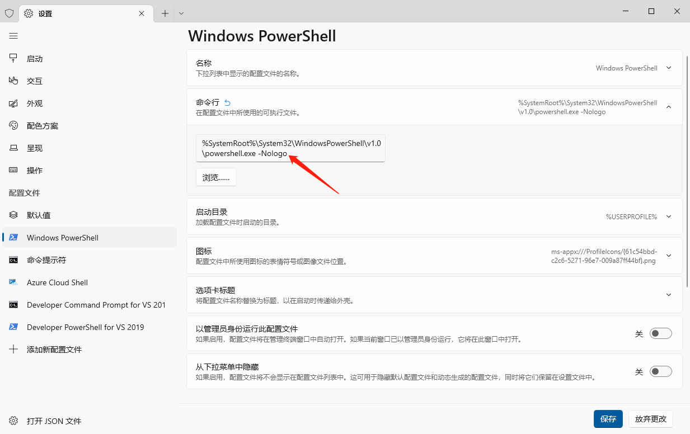
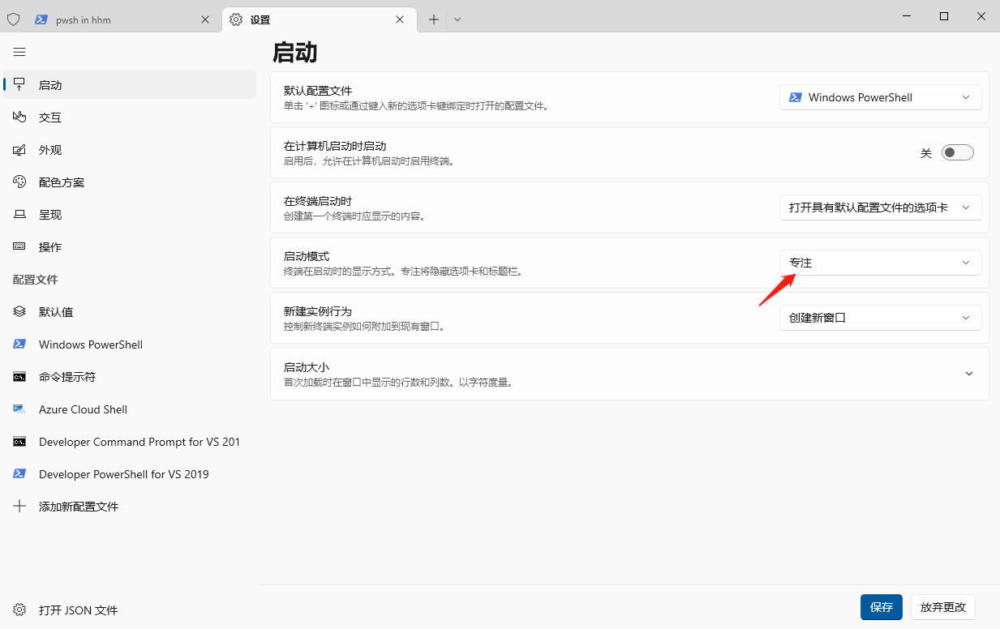

# windows-play
> 本文介绍如何玩转windows

## wox启动器
https://github.com/Wox-launcher/Wox

使用alt+space即可唤醒，推荐将主题设置为blur white

## 美化终端
1. 在Microsoft store中下载windows terminal

注意，wox中可以用wt就能搜索启动起来


2. 将windows terminal背景设置50%透明度


3. 去掉终端的logo信息



4. 设置专注模式快捷键

我习惯使用ctrl+p

5. 设置默认启动为【专注模式】.





## oh-my-posh安装
1. 在Microsoft store中安装oh-my-posh

2. 安装字体，字体文件在本github上有


3. 在wt上的json配置文件中设置字体
```json
       "defaults": 
        {
            "font": 
            {
                "face": "MesloLGM NF"
            }
        },
```

## on-my-posh linux安装

```sh
wget https://github.com/JanDeDobbeleer/oh-my-posh/releases/download/v13.5.0/posh-linux-amd64 -O /usr/local/bin/oh-my-posh

mkdir ~/.poshthemes

wget https://github.com/JanDeDobbeleer/oh-my-posh/releases/download/v13.5.0/themes.zip -O ~/.poshthemes/themes.zip

rm ~/.poshthemes/themes.zip

vi ~/.bashrc 
eval "$(oh-my-posh --init --shell bash --config ~/.poshthemes/kushal.omp.json)"
```


## vscode中的on-my-posh字体显示问题
1. ctrl+逗号 输入Integrated:Font Family，然后填入字体MesloLGM NF即可


4. 主题

使用Get-PoshThemes命令可以列出所有本地的主题，结尾处还会显示你的主题配置文件的路劲，一般是Microsoft.PowerShell_profile.ps1。只要修改里面的配置，替换为如下命令：

oh-my-posh init pwsh --config $env:POSH_THEMES_PATH\kushal.omp.json | Invoke-Expression

其中kushal.omp.json的kushal就是主题名称


## 安装lf文件终端管理器

1. 安装go环境，这个很简单
2. 使用命令安装lf
```sh
set CGO_ENABLED=0
go install -ldflags="-s -w" github.com/gokcehan/lf@latest
```


## ssh
```sh
 ssh root@150.158.186.188
```
### 免密登录
1. windows下生成密钥文件
```sh
ssh-keygen -t rsa
```

2. 拷贝密钥到远程服务器
```sh
scp C:\Users\hhm\.ssh\id_rsa.pub root@150.158.186.188:~/.ssh/
```

3. 登录到远程服务器，执行命令
```sh
cat ~/.ssh/id_rsa.pub >> ~/.ssh/authorized_keys\
```

4. 在本地windows下的C:\Users\hhm\.ssh路径新增文件config，内容如下
```
Host tencent
User root
Hostname 150.158.186.188
IdentityFile C:\Users\hhm\.ssh\id_rsa
```

5. 直接命令连接
```sh
ssh tencent
```


## 自动补全

1. 安装PSReadLine
```sh
Install-Module PSReadLine -Force
```

2. 编辑配置文件，加入配置
```sh
notepad $PROFILE
```

导入PSReadLine并开启历史记录

```
Import-Module PSReadLine
Set-PSReadLineOption -PredictionSource History
```


## 文件共享无密码
我们在共享文件，访问者总是被要求输入密码

